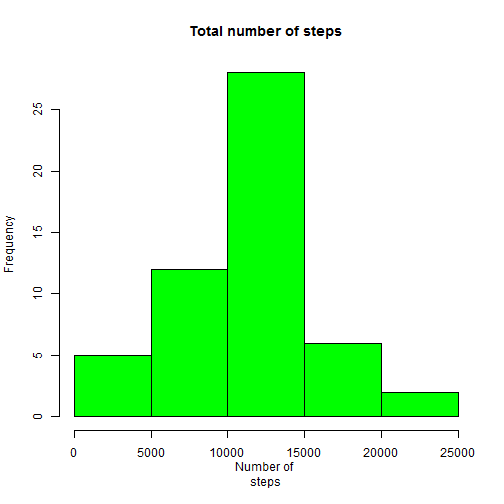
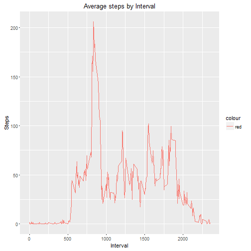
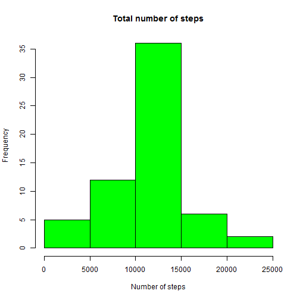
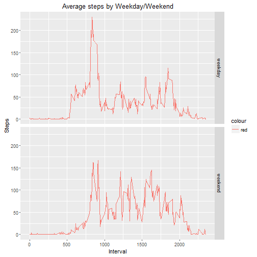

#Reproducible Research Assignment
-------------------------------------------

## Introductions
This is an assignment for "Reproducible research" which involves multiple activities like processing data, creating plots and then creating an integrated project having the steps to the research, code that can be reproduced and the output.
This assignment makes use of data from a personal activity monitoring device. This device collects data at 5 minute intervals through out the day. The data consists of two months of data from an anonymous individual collected during the months of October and November, 2012 and include the number of steps taken in 5 minute intervals each day.


##Loading and Preprocessing the data

Data is imported from  "activity.csv" and the date is transformed


```r
activity<-read.csv("activity.csv", header = TRUE)
str(activity)
```

```
## 'data.frame':	17568 obs. of  3 variables:
##  $ steps   : int  NA NA NA NA NA NA NA NA NA NA ...
##  $ date    : Factor w/ 61 levels "2012-10-01","2012-10-02",..: 1 1 1 1 1 1 1 1 1 1 ...
##  $ interval: int  0 5 10 15 20 25 30 35 40 45 ...
```

date column is converted to date class using the below code


```r
activity<-transform(activity, date = as.Date(date,"%Y-%m-%d"))
```


##What is mean total number of steps taken per day?

### Calculate the total number of steps taken per day


```r
act_day<-aggregate(activity$steps, by = list(activity$date), sum)
names(act_day)<-c("Date","Steps") #renaming the columns
```

### Histogram of the total number of steps taken each day


```r
hist(act_day$Steps, col = "green", main = "Total number of steps", xlab = "Number of 
steps")
```



### Mean and median number of steps taken each day


```r
summary(act_day$Steps)
```

```
##    Min. 1st Qu.  Median    Mean 3rd Qu.    Max.    NA's 
##      41    8841   10760   10770   13290   21190       8
```

The mean and median values can be found in the above summary

## What is the average daily activity pattern?

## Calculate the average steps per 5 minute interval and create a time series plot


```r
act_interval<-aggregate(activity$steps, by = list(activity$interval), mean, na.rm=TRUE)
names(act_interval) <- c("Interval", "Steps")

library(ggplot2)
```

```
## Warning: package 'ggplot2' was built under R version 3.2.5
```

```r
g<-ggplot(act_interval, aes(Interval,Steps))
g + geom_line(aes(color = "red")) + labs(title = "Average steps by Interval")
```



##The 5-minute interval that, on average, contains the maximum number of steps


```r
which.max(act_interval$Steps) # this will give the row which has the highest average number of steps
```

```
## [1] 104
```

```r
act_interval[which.max(act_interval$Steps),] #using the above function will give the Interval and highest average
```

```
##     Interval    Steps
## 104      835 206.1698
```

## Imputing missing values

### Total number of rows with missing values

This can be determined using multiple ways like summary, is.na functions etc. I have used complete.cases to find this out.


```r
table(complete.cases(activity)) # to determine the number of complete cases
```

```
## 
## FALSE  TRUE 
##  2304 15264
```

### Fill missing values
I have used the average of 5 minute interval to update the NA values


```r
activity_updated<-activity
for(i in 1:nrow(activity_updated)){
    if(is.na(activity_updated[i, 1])){
      tempinteval<- activity_updated[i, 3] # Get the interval for the row with NA
      activity_updated[i, 1] <- act_interval[act_interval$Interval==tempinteval, 2] # Retrieve the average step count for that interval
    }
}
```

### Historam with the updated dataset


```r
act_day_up<-aggregate(activity_updated$steps, by = list(activity_updated$date), sum)
names(act_day_up)<-c("Date","Steps") #renaming the columns
hist(act_day_up$Steps, col = "green", main = "Total number of steps", xlab = "Number of steps")
```



### comparison of mean and median of the 2 datasets


```r
summary(act_day$Steps)
```

```
##    Min. 1st Qu.  Median    Mean 3rd Qu.    Max.    NA's 
##      41    8841   10760   10770   13290   21190       8
```

```r
summary(act_day_up$Steps)
```

```
##    Min. 1st Qu.  Median    Mean 3rd Qu.    Max. 
##      41    9819   10770   10770   12810   21190
```

There is no change in the mean, but the median has gone up slightly

## Are there differences in activity patterns between weekdays and weekends?

### creating dataset with indicators for daytype - weekday/weekend


```r
activity_updated$daytype<- ifelse(weekdays(activity_updated$date) %in% c("Saturday", "Sunday"), "weekend", "weekday")

act_weekday<-activity_updated[activity_updated$daytype == "weekday", ]
act_weekend<-activity_updated[activity_updated$daytype == "weekend", ]

act_weekday_int<-aggregate(act_weekday$steps, by = list(act_weekday$interval), mean)
names(act_weekday_int)<-c("Interval", "Steps")
act_weekday_int$daytype<-"weekday"

act_weekend_int<-aggregate(act_weekend$steps, by = list(act_weekend$interval), mean)
names(act_weekend_int)<-c("Interval", "Steps")
act_weekend_int$daytype<-"weekend"

act_week_int<-rbind(act_weekday_int,act_weekend_int)
```


### Panel plot to show average number of steps taken, averaged across all weekday days or weekend days 


```r
g<-ggplot(act_week_int, aes(Interval,Steps))
g + geom_line(aes(color = "red")) + labs(title = "Average steps by Weekday/Weekend") + facet_grid(daytype~.)
```



We observe that there is more activity over the weekdays compared to the weekend.
